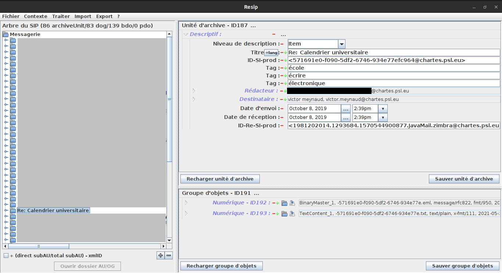

# Archimail

Ce projet a été réalisé lors d'un stage de fin d'études au Conseil d'Etat dans le cadre du Master 2 de l'Ecole nationale des chartes (année universitaire 2020-2021).

## Objectif

L'objectif est de fournir un script complémentaire aux outils développés dans le cadre du [programme VITAM](https://www.programmevitam.fr/), par exemple les [SEDA Tools](https://github.com/ProgrammeVitam/sedatools), à utiliser dans le cadre d'un projet de pérennisation numérique des données de courriers électroniques. 

## Grands principes

Le script prend en entrée un SIP généré via [RESIP](https://www.programmevitam.fr/pages/ressources/resip/) (quasi-conforme au [SEDA 2.1](https://francearchives.fr/seda/) avec RESIP 2.3) et au format .zip. Il retourne ce même SIP zippé avec un manifeste enrichi de nouvelles métadonnées et un nouveau fichier CSV de pérennisation des URL documenté dans le manifeste. Ce nouveau SIP est toujours conforme au profil minimum ADAMANT (cf. dossier **`seda/`**) et peut être joué dans l'outil RESIP. 

Le développement a été réalisé avec RESIP dans ses versions 2.3 et 2.5.

Le script repose sur 3 grands principes:

- Enrichir le manifeste SEDA avec des métadonnées type "mots-clefs" au niveau de chaque mail, c'est-à-dire à la granularité la plus basse (pièce/*item*). Ces métadonnées seront utiles pour les besoins de recherche dans les archives définitives.
- Tester la validité des éventuelles URL trouvées dans les mails au moment du traitement ainsi que leur éventuel archivage par [Internet Archive](https://archive.org/web/) et insérer la documentation de ces tests au format CSV dans le SIP.
- Documenter toutes les modifications faites dans le manifeste.

## Fonctionnalités

Le script propose les fonctionnalités suivantes :

- Détermination de 3 mots-clefs par mail (tokenisation, lemmatisation, évitement des noms propres) qui serviront de métadonnées de recherche basiques.
- Dans le cas des [fils de mails](https://docs.microsoft.com/fr-fr/microsoft-365/compliance/email-threading-in-advanced-ediscovery?view=o365-worldwide), évitement du bloc de métadonnées présent dans chaque segment des fils dans le calcul des mots-clefs.
- Enrichissement du manifeste SEDA avec ces nouvelles métadonnées.
- Test des URLs ainsi que leur éventuel enregistrement par la Wayback Machine (Internet Archive).
- Génération d'un fichier CSV rassemblant pour chaque mail les mots-clefs et les URLs testées. Ce fichier est joint au SIP.
- Documentation de ces modifications dans le manifeste via des *events*. 

Plus de détail sur les fonctionnalités:

### Enrichissement des métadonnées

Le corps de chaque mail est parsé par le script. En utilisant deux librairies de traitement automatique du langage naturel ([NLTK](https://www.nltk.org/) et [Spacy](https://spacy.io/)), les mots sont tokenisés (suppression des mots outils etc...), lemmatisés (chaque mot est ramené à sa forme du dictionnaire) et classés par nombre d'occurences. Les trois mots qui ont le plus d'occurences sont retenus pour servir de mots-clefs et enrichir les métadonnées de description SEDA du mail dans le manifeste via la balise *tag*. 

Le script utilise également les fonctions de classification des librairies citées afin d'éviter d'insérer dans les métadonnées des noms propres (*Named Entity Recognition*).

Ces nouvelles métadonnées sont automatiquement insérées dans le manifeste SEDA selon l'exemple suivant :

```xml
<ArchiveUnit id="ID25">
<Content>
<DescriptionLevel>Item</DescriptionLevel>
<Title>Création du compte Instagram</Title>
<OriginatingSystemId>&lt;7b88c65f-2573-ce0f-cef5-0c79b1f5d600@example.com&gt;</OriginatingSystemId>
<!-- Ci-dessous les mots-clefs rajoutés -->
<Tag>élément</Tag>
<Tag>photo</Tag>
<Tag>événement</Tag>
<Writer>
<FullName>john doe</FullName>
<Identifier>john.doe@example.com</Identifier>
</Writer>
<Addressee>
<FullName>jane doe</FullName>
<Identifier>jane.doe@site.fr</Identifier>
</Addressee>
<SentDate>2019-09-26T12:51:02Z</SentDate>
<ReceivedDate>2019-09-26T12:51:02Z</ReceivedDate>
</Content>
<DataObjectReference>
<DataObjectGroupReferenceId>ID26</DataObjectGroupReferenceId>
</DataObjectReference>
</ArchiveUnit>

```
NB : Ces fonctionnalités ne peuvent être utilisées à leur potentiel maximum qu'avec des données rédigées en langue française. 

Ces enrichissements sont documentés au niveau le plus haut des métadonnées de description de la façon suivante:

```xml
<DescriptiveMetadata>
      <ArchiveUnit id="ID10">
        <Management>
         [...]
        </Management>
        <Content>
          <DescriptionLevel>RecordGrp</DescriptionLevel>
          <Title>Messagerie de John Doe</Title>
          <Description>Ce paquet d'archives contient la messagerie de John Doe, responsable du service Lorem Ipsum.</Description>
          <CustodialHistory>
            <CustodialHistoryItem>Vivamus ac hendrerit dolor, quis porttitor augue. In sed ex hendrerit odio tempus aliquam.</CustodialHistoryItem>
          </CustodialHistory>
          <Tag>lorem</Tag>
          <Tag>ipsum</Tag>
          <Tag>dolor</Tag>
          <StartDate>2019-09-26T12:51:00</StartDate>
          <EndDate>2019-10-11T08:51:00</EndDate>
          <Event>
            <EventType>Enrichissement des métadonnées au niveau de chaque message via un script Python</EventType>
            <EventDateTime>2021-05-14T14:00:00</EventDateTime>
            <EventDetail>Enrichissement du manifeste SEDA par le Bureau des Archives [...]</EventDetail>
          </Event>
    [...]
</DescriptiveMetadata>

```

### La pérennisation des URLs

Le script génère un fichier CSV nommé par défaut ArchimailMetadata (séparateur : point-virgule) qui, pour chaque mail, comporte les colonnes suivantes (recommandation [INTERPARES](http://interpares.org/)):
- Le nom du mail (chemin relatif)
- Les 3 mots-clefs
- Les URLs trouvées
- Le statut du test (code HTTP)
- Le *timestamp* du test
- Le nom du responsable de l'URL sous la forme subdomain + domain + top-level domain 
- Le statut (HTTP) et la disponibilité renvoyée par l'API de la Wayback Machine. 
- Le lien vers cet enregistrement
- Le *timestamp* de l'enregistrement

Ce fichier est inséré dans le SIP comme document de description complémentaire généré par les Archives. Il est automatiquement documenté dans le manifeste de la manière suivante:

```xml
<Content>
    <DescriptionLevel>Item</DescriptionLevel>
    <Title>ArchimailMetadata.csv</Title>
    <Event>
        <EventType>Création</EventType>
        <EventDateTime>2021-05-14T14:00:00</EventDateTime>
        <EventDetail>Fichier généré automatiquement via un script écrit dans le langage Python par le Bureau des Archives. Le fichier CSV (comma separated values), pour chaque courriel, indique les 3 mots-clefs qui ont été déterminés et insérés dans le manifeste. 
    Le script réalise également une opération de pérennisation des URL (Uniform Resource Locator) selon les recommandations du groupe de recherche
    INTERPARES. Dans le corps des mails, les URL sont détectées via une expression régulière. Le script inscrit dans le CSV le
    code HTTP renvoyé (permettant de vérifier si l'URL est encore active lors du traitement par les Archives), la date
    du test et le nom du site (sous la forme subdomain + domain + top-level domain). De plus, le script teste aussi la disponibilité
    de l'URL en question sur l'API de la Wayback Machine (Internet Archive). Si l'archive existe, il écrit dans le CSV la disponibilité et le code HTTP renvoyés par l'API, l'URL de la page archivée, et la date de l'archivage.</EventDetail>
    </Event>
</Content>
````

Exemple de données structurées dans le CSV:

| nom_fichier        | top_trois_mots      | url(s)                    | resultat_test_url | date_test_url              | responsable_url    | internet_archive_dispo | internet_archive_url                                                | internet_archive_timestamp |
|--------------------|---------------------|---------------------------|-------------------|----------------------------|--------------------|------------------------|---------------------------------------------------------------------|----------------------------|
| content/ID1197.eml | foo, bar, test | https://www.conseil-etat.fr/ | 200               | 2021-05-07 13:33:04.710089 | www.conseil-etat.fr | True                   | http://web.archive.org/web/20210418112501/http://www.conseil-etat.fr | 20210418112501             |

S'il y a plusieurs éléments à afficher dans une cellule, ils sont séparés par une virgule.

### URLs à éviter

Le script propose une variable, de type liste, *url_a_eviter* que l'utilisateur peut mettre à jour. En effet, étant donné que le fait d'envoyer des requêtes HTTP est chronophage, il est recommandé de lister les URLs dont le test systématique n'est pas utile intellectuellement (par exemple, un lien vers un réseau social systématiquement placé en signature etc...).

### Validation par rapport à un schéma XML

A l'heure de la rédaction de ces lignes (mai 2021), les manifestes produits par l'outil RESIP dans le cadre du traitement des courriels ne sont pas conformes au SEDA 2.1 par défaut (ils incorporent des balises qui ne sont pas encore canonisées dans le standard SEDA). Après enrichissement du manifeste, le script vérifie donc la conformité du nouveau manifeste uniquement avec le **profil minimum ADAMANT**.

Le dossier **`seda/`** contient les schémas du SEDA 2.1. Celui-ci pourra éventuellement être mis à jour avec les nouvelles versions du SEDA.

### Nota

Le présent travail a été réalisé par rapport au SEDA 2.1. Toutes les institutions publiques françaises recevant des archives définitives n'implémentent pas le SEDA de la même façon et certaines balises valides selon le SEDA peuvent être refusés pour des raions propres aux institutions en question.

## Installation

### Prérequis

Les packages suivants sont nécessaires. Lancez depuis votre terminal (Mac / Linux) la commande suivante qui vérifiera si les packages existent sur votre système et les installera sinon

```bash
sudo apt-get install python3 libfreetype6-dev python3-pip python3-virtualenv
```

Clonez le présent *repository* dans un dossier de votre choix

 ```bash
git clone https://github.com/GisliSursson/Archimail.git
```

Créez un environnement virtuel (dossier) dans lequel seront installées les librairies nécessaires au script

```bash

virtualenv {chemin vers le dossier où vous voulez stocker votre environnement} -p python3
```

Activez l'environnement virtuel 

```bash
source {chemin vers le dossier de votre environnement}/bin/activate
```

Dans le dossier où vous avez cloné le projet, installez ensuite les librairies nécessaires (avec votre environnement virtuel activé)

```bash
pip install -r requirements.txt
```
Ensuite, téléchargez les données nécessaires à la librairie Spacy pour la langue française

```bash
python3 -m spacy download fr_core_news_md
```

Pour désactiver l'environnement virtuel, faire

```bash
deactivate 
```

### Lancement

Avant d'éxécuter le script, placez votre SIP issu de RESIP (compressé en .zip) dans le dossier **`sip/`**. Le script travaille sur une copie des données et ne modifie donc pas le SIP originel donné en entrée par l'utilisateur.

Ensuite, avec votre environnement virtuel activé, lancez dans votre terminal:
```bash
python3 main.py 
```

Le script retournera le SIP enrichi (nommé "SIP_{date}.zip") au niveau racine du dépôt clôné. 

### Exemple de log terminal

```bash
[nltk_data] Downloading package stopwords to /home/victor/nltk_data...
[nltk_data]   Package stopwords is already up-to-date!
[nltk_data] Downloading package punkt to /home/victor/nltk_data...
[nltk_data]   Package punkt is already up-to-date!
Décompression du ZIP du SIP...
Décompression terminée
465 mails ont été détectés dans le dossier 'content' du SIP
Début de l'analyse des fichiers des courriels...
Mail en cours de traitement : ID1258.eml
Mails traités : 1
Mail en cours de traitement : ID1615.eml
Mails traités : 2
Mail en cours de traitement : ID3006.eml
Mails traités : 3
Mail en cours de traitement : ID2800.eml
Mails traités : 4
Mail en cours de traitement : ID1764.eml
Mails traités : 5
[...]
Mails traités : 465
Nombre total de mails traités : 465
Nombre d'URL traitées : 180
Nombre d'éléments détectés comme des noms propres : 9158
Nombre de requêtes réussies faites à Internet Archive : 119
Temps de calcul : 0:11:52.654727
Génération du manifeste enrichi...
Nombre de balises <tag> ajoutées : 1392
Documentation de l'enrichissement du manifest...
Documentation terminée
Documentation dans le manifeste de la génération du CSV de métadonnées Archimail (mots-clefs et URL)...
Documentation terminée
Suppression des espaces blancs inutiles dans le nouveau manifeste...
Suppression terminée
Document testé par rapport au profil minimum ADAMANT : /home/victor/Documents/conseil_etat/sip_tempdir/manifest_new.xml
Votre manifeste est conforme au profil minimum ADAMANT!
Suppression de l'ancien manifeste et remplacement par le nouveau enrichi...
Remplacement effectué
Recompression du SIP...
Compression du SIP terminée
Suppresion des fichiers temporaires...
Suppresion effectuée
Script terminé avec succès
```

### Exemple de visualisation d'un courriel traité avec l'outil RESIP



### Tests

Le script est testé via le service d'intégration continue [Travis CI](https://travis-ci.com/). Les tests sont lancés à chaque modification du dépôt principal afin de vérifier que le script retourne toujours des données cohérentes. Il est possible de visualiser l'exécution de ces tests ici : [lien](https://travis-ci.com/github/GisliSursson/Archimail).

Les tests reposent sur le principe de génération de données *dummy* aléatoires (au format EML pour les mails et aux formats PDF et ODT pour les pièces jointes). Le script est lancé sur ces données *dummy* et génère le CSV des métadonnées (mots-clefs, URL...). Les tests vérifient ensuite la cohérence des métadonnées du CSV. 

Pour lancer manuellement les tests en local, on utilisera la commande suivante (en étant dans l'environnement virtuel du projet):

```bash
pytest test_archimail.py 
```

Le script a également été testé manuellement avec des données e-mail réalistes anonymisées et rendues publiques par la justice américaine après le scandale [Enron](https://fr.wikipedia.org/wiki/Enron) et hébergées par la [Faculté d'informatique de l'Université Carnegie Mellon](https://www.cs.cmu.edu/~enron/). Ces tests manuels visent à tester l'insertion des métadonnées nouvelles dans le manifeste, les aspects linguistiques du script n'étant pertinents que pour la langue française. 

### SIP exemples

Le dossier dossier **`sip_exemples/`** contient des SIP issus du dataset Enron, généré avec RESIP avec un traitement minimaliste. Ils peuvent être utilisés pour tester le script. N.B. : étant donné que ces messageries sont en langue anglaise, le calcul des mots-clefs ne sera pas pertinent. 